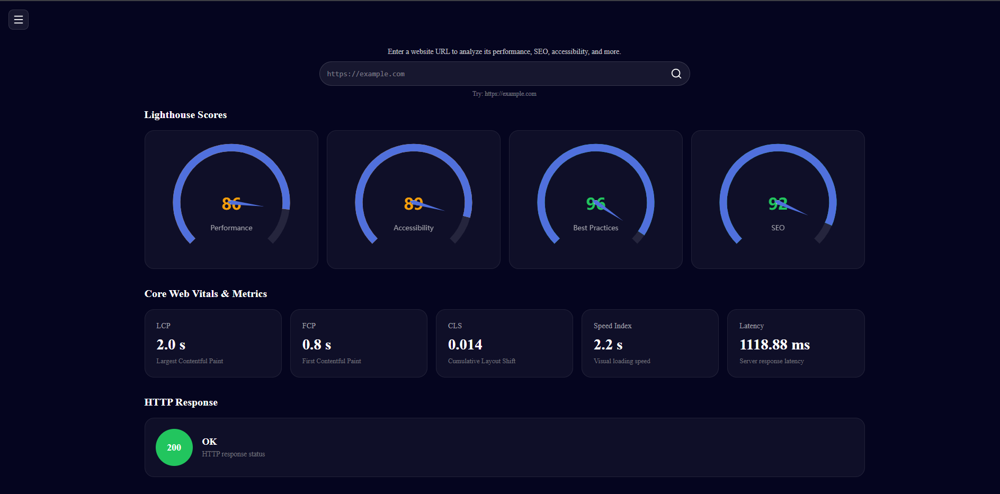
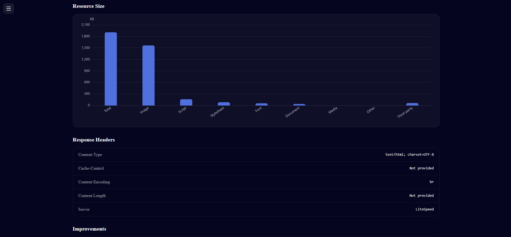
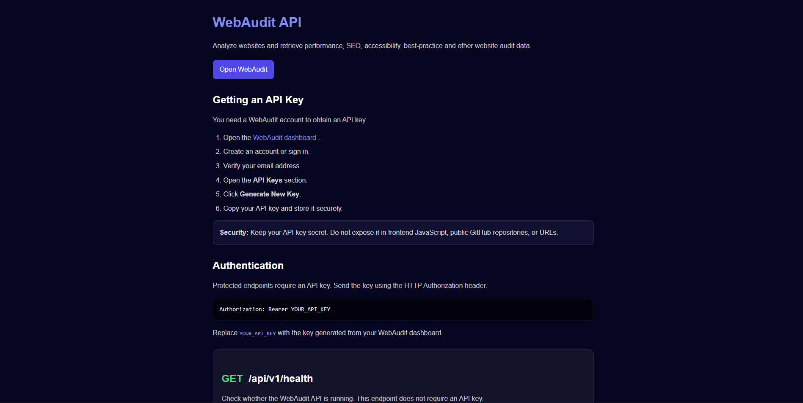
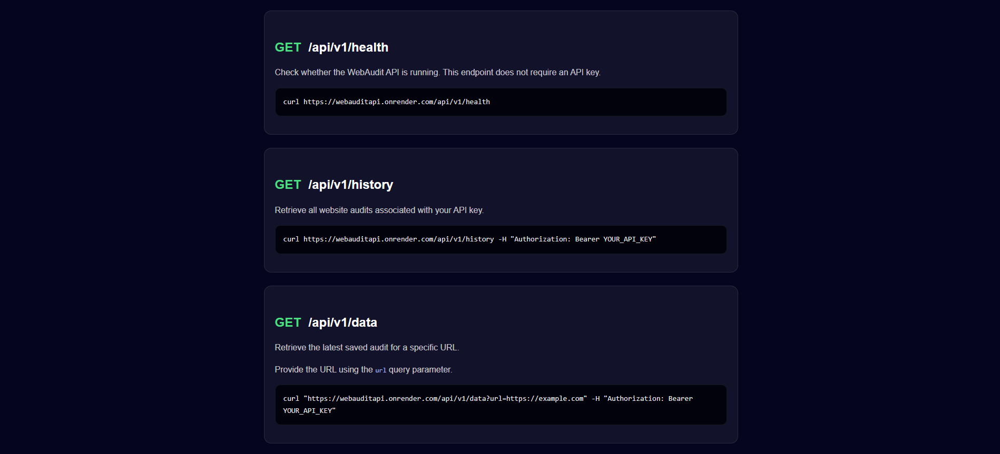

# WebAudit

WebAudit is a website auditing tool that checks a URL and returns useful information about its performance, SEO, accessibility, and best practices.

The project has a frontend and an Express API. Website audits are handled through Google's PageSpeed Insights API, which provides the Lighthouse results.

## Features

- Website performance audit
- SEO score
- Accessibility score
- Best Practices score
- CLS, LCP, FCP and Speed Index
- HTTP status and response headers
- Resource size information
- Website improvement suggestions
- Audit history
- API-key authentication
- REST API for running and retrieving audits

## Live API

WebAudit API:

https://webauditapi.onrender.com

The backend handles authentication, API requests, audit processing, database operations, and the PageSpeed Insights integration.

## Screenshots

### Audit Dashboard



The dashboard shows the Lighthouse scores, Core Web Vitals, latency, and HTTP response status.

### Resource Analysis



Resource sizes are grouped by type so it is easier to see where a page's resources are being used.

### Improvements


The audit lists areas that can be improved, including caching, image delivery, render-blocking requests, unused CSS/JavaScript, and other Lighthouse findings.

### API Documentation



The API documentation explains authentication and how to use the available endpoints.

### API Endpoints



The documentation includes examples for the health, history, and data endpoints.

## How It Works

```text
User
  │
  ▼
WebAudit Frontend
  │
  ▼
Express API
  │
  ├── Authentication
  ├── MongoDB
  │
  └── PageSpeed Insights API
          │
          ▼
       Lighthouse
          │
          ▼
     Audit Results
```

The backend sends the target website URL to PageSpeed Insights and processes the returned Lighthouse data before sending the result back to the frontend.

## Tech Stack

**Frontend**
- Next.js
- React

**Backend**
- Node.js
- Express
- MongoDB
- Mongoose
- PageSpeed Insights API

**Deployment**
- Frontend: Vercel
- Backend: Render

## Project Structure

```text
WebAudit/
├── frontend/
│   └── Next.js app
│
├── backend/
│   ├── src/
│   │   └── lighthouse.js
│   ├── index.js
│   └── package.json
│
├── screenshots/
│   ├── dashboard.png
│   ├── resource-analysis.png
│   ├── improvements.png
│   ├── api-documentation.png
│   └── api-endpoints.png
│
├── .env.example
├── .gitignore
└── README.md
```

## Environment Variables

Environment variables are intentionally not included in the repository.

If you clone or fork the project, create your own `.env` file using `.env.example` as a template.

For example:

```bash
cp .env.example .env
```

Then add your own credentials.

### Backend variables

```env
PORT=4000
DB_URL=
PAGESPEED_API_KEY=
FRONTEND_URL=http://localhost:3000
EMAIL=
APP_PASSWORD=
```

`EMAIL` and `APP_PASSWORD` are only required if the email/OTP authentication functionality is enabled in the version you are running.

Never put real credentials in `.env.example`.

## Security

Do not commit:

- `.env`
- MongoDB connection strings
- PageSpeed API keys
- Email passwords or app passwords
- User API keys

The `.env.example` file contains placeholders only and is safe to commit.

If a secret is accidentally pushed to GitHub, rotate/revoke it rather than only deleting the file.

## .gitignore

The repository should ignore environment files and generated dependencies/build files.

Example:

```gitignore
node_modules/
.next/
dist/

.env
.env.*
!.env.example
```

## Running Locally

Clone the repository:

```bash
git clone <your-repository-url>
cd WebAudit
```

Install backend dependencies:

```bash
cd backend
npm install
```

Create the environment file:

```bash
cp .env.example .env
```

Fill in the required values in `.env`.

Install frontend dependencies:

```bash
cd ../frontend
npm install
```

Start the backend:

```bash
cd backend
npm start
```

Start the frontend in another terminal:

```bash
cd frontend
npm run dev
```

The frontend will normally be available at:

```text
http://localhost:3000
```

The backend will normally be available at:

```text
http://localhost:4000
```

## API

Base URL:

```text
https://webauditapi.onrender.com
```

### Health

```http
GET /api/v1/health
```

Checks whether the API is running.

```bash
curl https://webauditapi.onrender.com/api/v1/health
```

This endpoint does not require an API key.

### Run an Audit

```http
POST /api/v1/analyze
```

Runs a new audit and saves the result.

```bash
curl -X POST https://webauditapi.onrender.com/api/v1/analyze \
  -H "Content-Type: application/json" \
  -H "Authorization: Bearer YOUR_API_KEY" \
  -d '{"url":"https://example.com"}'
```

### Get Latest Audit

```http
GET /api/v1/data?url=https://example.com
```

Returns the latest saved audit for the requested URL.

```bash
curl "https://webauditapi.onrender.com/api/v1/data?url=https://example.com" \
  -H "Authorization: Bearer YOUR_API_KEY"
```

### Get History

```http
GET /api/v1/history
```

Returns previous audits associated with the authenticated API key.

```bash
curl https://webauditapi.onrender.com/api/v1/history \
  -H "Authorization: Bearer YOUR_API_KEY"
```

## Authentication

Protected endpoints use a Bearer token:

```http
Authorization: Bearer YOUR_API_KEY
```

Example:

```bash
curl https://webauditapi.onrender.com/api/v1/history \
  -H "Authorization: Bearer YOUR_API_KEY"
```

Keep API keys private and never commit them to the repository.

## Example Response

A successful audit has a structure similar to:

```json
{
  "URL": "https://example.com",
  "Performance": {
    "Score": 0.92
  },
  "SEO": {
    "Score": 1
  },
  "Accessibility": {
    "Score": 0.95
  },
  "Best_Practices": {
    "Score": 0.9
  },
  "CLS": {
    "Score": 0.98,
    "DisplayValue": "0.02"
  },
  "LCP": {
    "Score": 0.9,
    "DisplayValue": "1.8 s"
  },
  "FCP": {
    "Score": 0.95,
    "DisplayValue": "0.9 s"
  },
  "SpeedIndex": {
    "Score": 0.92,
    "DisplayValue": "1.2 s"
  },
  "StatusCode": 200,
  "StatusText": "OK",
  "Latency": "245.31"
}
```

The values in a real response depend on the website being analyzed.

## PageSpeed Insights

WebAudit uses the PageSpeed Insights API to run the website audit.

The backend sends the target URL to PageSpeed Insights and uses the returned Lighthouse result to build the WebAudit response.

This means the deployed backend does not need to install or launch Chrome/Puppeteer for the audit.

## Deployment

### Backend

The backend is deployed as a Render Web Service.

Configure your own environment variables in Render:

```env
DB_URL=...
PAGESPEED_API_KEY=...
FRONTEND_URL=https://your-frontend.vercel.app
EMAIL=...
APP_PASSWORD=...
```

The actual values must be entered in Render's environment settings and must not be committed to GitHub.

Then deploy the backend with:

```bash
npm start
```

### Frontend

The frontend is deployed on Vercel.

The frontend communicates with the Render backend for authentication and API operations.

## Notes

Audit time depends on the website being tested and the PageSpeed Insights service.

The PageSpeed Insights API also has quotas, so the number of audits that can be run depends on the quota available to the Google Cloud project.

When another developer forks the repository, they need to provide their own database, PageSpeed API key, and any other credentials required by the application.

## Contributing

1. Fork the repository.
2. Create a new branch.
3. Create your own `.env` from `.env.example`.
4. Make your changes.
5. Test the frontend and API.
6. Open a pull request.

## License

Add a license to the project if you plan to distribute the code publicly.
